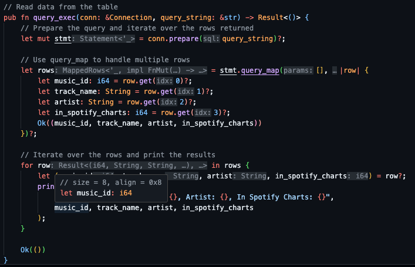

# Rust SQLite CLI Tool

## Setup

This project is an expansion on the Rust SQLite CLI tool developed in the [Rust_SQLite Repository](https://github.com/johncoogan53/Rust_SQLite.git). The repository contains a base CLI tool, how to set up a project to use the CLI tool, as well as some relevant notes about Rust.

Additionally, the tool was modified to take a filtered version of the top Spotify songs of 2023. The dataset contains the Music ID, Track Name, Artist, and Spotify Chart Ranking.

## Project Breakdown

The main.rs file was updated from the reference template to allow for updates to be made.  The CLI can now Create, Load, Query, Update, and Delete thus fulfilling our requirements for CRUD operations.The main.rs also contains a commented example of the CLI construction. 

Below is a screenshot showing the tool used from start to finish. The top of the image shows the help menu for the CLI tool `sqlite`. We then Create a table called `spotify_2023`, Populated the data (Load) from a CSV file into `spotify_2023`, Query the table by selecting the top 3 entries, Update the first entry in the table, and finally Delete the table. 

Notable Gaps:

* The tool is currently built for the Spotify data located in the `data` folder.

This is partially by design as mentioned in the reference template "there are ways to make this more generalized but Rust prefers for you to be explicit about what you expect, this is part of its safety benefits." 

Similarly Create, Load, and Update expect the same specific schema.

* Due to time constraints, test have not yeat been added but will be on future iterations of the project.

## Binary Download Link

https://github.com/nogibjj/Alex_Ackerman_Mini_Project_7_Rust_CLI/actions/runs/11489225179/artifacts/2096228477
