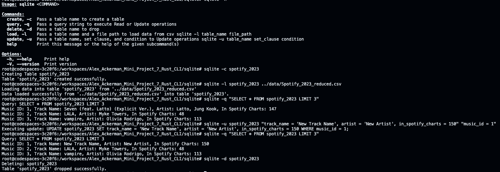

[](https://github.com/ackerman-alex/Alex_Ackerman_Individual_Project_Individual_Project_2_Rust_CLI/actions/workflows/CI.yml)

# Alex_Ackerman_Individual_Project_2_Rust_CLI

# Rust SQLite CLI Tool

## Video Walkthrough

[Project walkthrough on Youtube](https://youtu.be/65KggmFHpQI)

## Setup

This project is an expansion on the Rust SQLite CLI tool developed in the [Rust_SQLite Repository](https://github.com/johncoogan53/Rust_SQLite.git). The repository contains a base CLI tool, how to set up a project to use the CLI tool, as well as some relevant notes about Rust.

Additionally, the tool was modified to take a filtered version of the top Spotify songs of 2023. The dataset contains the Music ID, Track Name, Artist, and Spotify Chart Ranking.

## Data

The dataset used in this project is a modified version of the original data found on the [RunCHIRON repository](https://github.com/RunCHIRON/dataset/blob/main/Spotify_2023.csv). The original dataset was reduced to the columns `music_id`, `track_name`, `artist`, and `in_spotify_charts`.

## Use of Large Language Models

LLMs are particularly useful at translating between coding languages and for adding small features to an exsiting script. For this project I was able to take the script in main.rs and utilize ChatGPT to add an update function.

When I was having challenges reading in my dataset, ChatGPT help me add error handling code to see where my code was failing. It should be noted that the solution provided was not perfect and required some trial and error to figure out. Below depicts the error handling solutions I incorporated into my lib.rs.

```Rust
    // Loop that expects the specific schema
    for result in rdr.records() {
        let record = result?;
        let music_id: i64 = record[0].parse().expect("Failed to parse music_id");
        let track_name: &str = &record[1]; //.parse().expect("Failed to parse track_name");
        let artist: &str = &record[2]; //.parse().expect("Failed to parse artist");
        let in_spotify_charts: i64 = record[3].parse().expect("Failed to parse in_spotify_charts");

        conn.execute(&insert_query, params![music_id, track_name, artist, in_spotify_charts])?;
    }
```

## Project Breakdown

The main.rs file was updated from the reference template to allow for updates to be made.  The CLI can now Create, Load, Query, Update, and Delete thus fulfilling our requirements for CRUD operations.The main.rs also contains a commented example of the CLI construction. 

Below is a screenshot showing the tool used from start to finish. The top of the image shows the help menu for the CLI tool `sqlite`. We then Create a table called `spotify_2023`, Populated the data (Load) from a CSV file into `spotify_2023`, Query the table by selecting the top 3 entries, Update the first entry in the table, and finally Delete the table. 



Notable Gaps:

* The tool is currently built for the Spotify data located in the `data` folder.

```Rust
// Read data from the table
pub fn query_exec(conn: &Connection, query_string: &str) -> Result<()> {
    // Prepare the query and iterate over the rows returned
    let mut stmt = conn.prepare(query_string)?;

    // Use query_map to handle multiple rows
    let rows = stmt.query_map([], |row| {
        let music_id: i64 = row.get(0)?;
        let track_name: String = row.get(1)?;
        let artist: String = row.get(2)?;
        let in_spotify_charts: i64 = row.get(3)?;
        Ok((music_id, track_name, artist, in_spotify_charts))
    })?;

    // Iterate over the rows and print the results
    for row in rows {
        let (music_id, track_name, artist, in_spotify_charts) = row?;
        println!(
            "Music ID: {}, Track Name: {}, Artist: {}, In Spotify Charts: {}",
            music_id, track_name, artist, in_spotify_charts
        );
    }

    Ok(())
}
```

This is partially by design as mentioned in the reference template "there are ways to make this more generalized but Rust prefers for you to be explicit about what you expect, this is part of its safety benefits." 

Similarly Create, Load, and Update expect the same specific schema.

* Due to time constraints, test have not yeat been added but will be on future iterations of the project.

## Binary Download Link

https://github.com/ackerman-alex/Alex_Ackerman_Individual_Project_Individual_Project_2_Rust_CLI/actions/runs/11543233644/artifacts/2109593364
